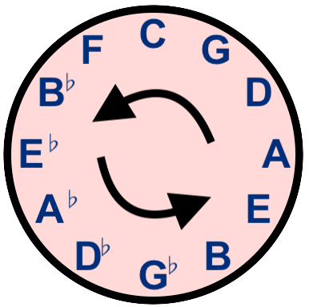

import GuitarTablature from '../../src/components/guitar-tablature'

# Practicing goals
  This harmonious fretboard-finger-dance will step through the Major 7 chord in every key. By dedicating time to this exercise, expect to see progress in several areas:
    - Technique: Speed, accuracy, and stamina will gradually improve, making complex patterns more manageable
    - Ear training: Familiarize and internalize the unique sound of the Major 7 chord to enrich your musical vocabulary 
    - Fretboard Navigation: You'll gain a deeper understanding of the fretboard by learning the notes of the arpeggios in all 12 keys

# How to practice this exercise
  Before delving into the exercise details, the importance of slow and mindful practice cannot be overstated. 

  It's not just about hitting the right notes; slow practice is a pathway to a deeper understanding of music. Here are some key considerations while you practice:

  - **Note Identification**: Playing each note should come with the recognition of its name (A, B, C, etc.). This familiarity with the fretboard enhances the ability to navigate it.

  - **Role Understanding**: Each note in a chord plays a specific role. Recognizing whether a note is the root, third, fifth, or seventh of the chord deepens the understanding of chord structure and harmony.

  - **Speed Management**: Getting lost on the fretboard or uncertainty about the note being played are signs of excessive speed. Slowing down allows time to process each note.

  The goal is not to achieve the highest speed, but to maximize your <i>understanding</i> of what you're playing. Speed is a byproduct of accuracy and understanding, so the focus should be on playing each note correctly and internalizing as you play. With time, speed will follow naturally. Don't force it! 

# The exercise
  The exercise presented here revolves around the Major 7 chords for all keys. The fingering pattern remains consistent across all keys, designed specifically to be played around the circle of fourths (or counter-clockwise around the circle of fifths).

## Circle of Fourths
  The journey begins in the key of A, progressing to the left to D, followed by G, and so on, until the circle of fourths is completed. 
    
    

  Starting with A proves beneficial as it demonstrates how the guitar frets wrap at the fifth fret in terms of fourths. The final key of the sequence is easily recognizable as it utilizes the open E string.

## The Major 7 fingering pattern
  Explore the exercise by selecting a key and playing the corresponding tablature. Once comfortable with the fingering pattern, attempt playing the exercise around the circle of fourths.

  <GuitarTablature 
    title={
      <>
        <h1>Major 7 Arpeggios</h1>
        <h5>Choose a key to transpose the tab</h5>
      </>
    }
    tabs={[
      { 
        label: 'A', 
        content: 
          

            <>
              {"   "}A  C♯ E  G♯ A  C♯ E  G♯ A  C♯ E  G♯ A     
                  e|----------------------------9--12-16-17-|  
                  B|----------------------9--10-------------|  
                  G|-------------------9--------------------|  
                  D|----------6--7--11----------------------|  
                  A|-------7--------------------------------|  
                  E|-5--9-----------------------------------|  
            </>
            <> 
                                                              
                  e|-17-16----------------------------------|  
                  B|-------17-14----------------------------|  
                  G|-------------14-13----------------------|  
                  D|-------------------14-------------------|  
                  A|----------------------16-12-11----------|  
                  E|-------------------------------12-9--5--|  
              {"   "}A  G♯ E  C♯ A  G♯ E  C♯ A  G♯ E  C♯ A     
            </>
        

      },
      { 
        label: 'D', 
        content:
          

            <>
              {"   "}D  F♯ A  C♯ D  F♯ A  C♯ D  F♯ A  C♯ D     
                  e|----------------------------14-17-21-22-|  
                  B|----------------------14-15-------------|  
                  G|-------------------14-------------------|  
                  D|----------11-12-16----------------------|  
                  A|-------12-------------------------------|  
                  E|-10-14----------------------------------|  
            </>
            <> 
                                                               
                  e|-22-21----------------------------------|  
                  B|-------22-19----------------------------|  
                  G|-------------19-18----------------------|  
                  D|-------------------19-------------------|  
                  A|----------------------22-17-16----------|  
                  E|-------------------------------17-14-10-|  
              {"   "}D  C♯ A  F♯ D  C♯ A  F♯ D  C♯ A  F♯ D     
            </>
        

      },
      { 
        label: 'G', 
        content:
          

            <>
              {"   "}G  B  D  F♯ G  B  D  F♯ G  B  D  F♯ G     
                  e|----------------------------7--10-14-15-|  
                  B|----------------------7--8--------------|  
                  G|-------------------7--------------------|  
                  D|----------4--5--9-----------------------|  
                  A|-------5--------------------------------|  
                  E|-3--7-----------------------------------|  
            </>
            <> 
                                                              
                  e|-15-14----------------------------------|  
                  B|-------15-12----------------------------|  
                  G|-------------12-11----------------------|  
                  D|-------------------12-------------------|  
                  A|----------------------14-10-9-----------|  
                  E|-------------------------------10-7--3--|  
              {"   "}G  F♯ D  B  G  F♯ D  B  G  F♯ D  B  G    
            </>
          

      },
      { 
        label: 'C', 
        content: 
          

            <>
              {"   "}C  E  G  B  C  E  G  B  C  E  G  B  C     
                  e|----------------------------12-15-19-20-|  
                  B|----------------------12-13-------------|  
                  G|-------------------12-------------------|  
                  D|----------9--10-14----------------------|  
                  A|-------10-------------------------------|  
                  E|-8--12----------------------------------|  
            </>
            <> 
                                                              
                  e|-20-19----------------------------------|  
                  B|-------20-17----------------------------|  
                  G|-------------17-16----------------------|  
                  D|-------------------17-------------------|  
                  A|----------------------19-15-14----------|  
                  E|-------------------------------15-12-8--|  
              {"   "}C  B  G  E  C  B  G  E  C  B  G  E  C    
            </>
        
  
      },
      { 
        label: 'F', 
        content:
          

            <>
              {"   "}F  A  C  E  F  A  C  E  F  A  C  E  F     
                  e|----------------------------5--8--12-13-|  
                  B|----------------------5--6--------------|  
                  G|-------------------5--------------------|  
                  D|----------2--3--7-----------------------|  
                  A|-------3--------------------------------|  
                  E|-1--5-----------------------------------|  
            </>
            <> 
                                                              
                  e|-13-12----------------------------------|  
                  B|-------13-10----------------------------|  
                  G|-------------10-9-----------------------|  
                  D|-------------------10-------------------|  
                  A|----------------------12-8--7-----------|  
                  E|-------------------------------8--5--1--|  
              {"   "}F  E  C  A  F  E  C  A  F  E  C  A  F     
            </>
          

      },
      { 
        label: 'B♭', 
        content:
          

    
            <>
              {"   "}B♭ D  F  A  B♭ D  F  A  B♭ D  F  A  B♭    
                  e|----------------------------10-13-17-18-|  
                  B|----------------------10-11-------------|  
                  G|-------------------10-------------------|  
                  D|----------7--8--12----------------------|  
                  A|-------8--------------------------------|  
                  E|-6--10----------------------------------|  
            </>
            <> 
                                                              
                  e|-18-17----------------------------------|  
                  B|-------18-15----------------------------|  
                  G|-------------15-14----------------------|  
                  D|-------------------15-------------------|  
                  A|----------------------17-13-12----------|  
                  E|-------------------------------13-10-6--|  
              {"   "}B♭ A  F  D  B♭ A  F  D  B♭ A  F  D  B♭    
            </>
          

      },
      { 
        label: 'E♭', 
        content:
          

            <>
              {"   "}E♭ G  B♭ D  E♭ G  B♭ D  E♭ G  B♭ D  E♭    
                  e|----------------------------15-18-22-23-|  
                  B|----------------------15-16-------------|  
                  G|-------------------15-------------------|  
                  D|----------12-13-17----------------------|  
                  A|-------13-------------------------------|  
                  E|-11-15----------------------------------|  
            </>
            <> 
                                                              
                  e|-23-22----------------------------------|  
                  B|-------23-20----------------------------|  
                  G|-------------20-19----------------------|  
                  D|-------------------20-------------------|  
                  A|----------------------22-18-17----------|  
                  E|-------------------------------18-15-11-|  
              {"   "}E♭ D  B♭ G  E♭ D  B♭ G  E♭ D  B♭ G  E♭    
            </>
          

      },
      { 
        label: 'A♭', 
        content:
          

            <>
              {"   "}A♭ C  E♭ G  A♭ C  E♭ G  A♭ C  E♭ G  A♭    
                  e|----------------------------8--11-15-16-|  
                  B|----------------------8--9--------------|  
                  G|-------------------8--------------------|  
                  D|----------5--6--10----------------------|  
                  A|-------6--------------------------------|  
                  E|-4--8-----------------------------------|  
            </>
            <> 
                                                              
                  e|-16-15----------------------------------|  
                  B|-------16-13----------------------------|  
                  G|-------------13-12----------------------|  
                  D|-------------------13-------------------|  
                  A|----------------------15-11-10----------|  
                  E|-------------------------------11-8--4--|  
              {"   "}A♭ G  E♭ C  A♭ G  E♭ C  A♭ G  E♭ C  A♭   
            </>
          

      },
      { 
        label: 'D♭',
        content:
          

            <>
              {"   "}D♭ F  A♭ C  D♭ F  A♭ C  D♭ F  A♭ C  D♭    
                  e|----------------------------13-16-20-21-|  
                  B|----------------------13-14-------------|  
                  G|-------------------13-------------------|  
                  D|----------10-11-15----------------------|  
                  A|-------11-------------------------------|  
                  E|-9--13----------------------------------|  
            </>
            <> 
                                                               
                  e|-21-20----------------------------------|  
                  B|-------21-18----------------------------|  
                  G|-------------18-17----------------------|  
                  D|-------------------18-------------------|  
                  A|----------------------21-16-15----------|  
                  E|-------------------------------16-13-9--|  
              {"   "}D♭ C  A♭ F  D♭ C  A♭ F  D♭ C  A♭ F  D♭    
            </>
          

      },
      { 
        label: 'G♭', 
        content:
          

            <>
              {"   "}G♭ B♭ D♭ F  G♭ B♭ D♭ F  G♭ B♭ D♭ F  G♭    
                  e|----------------------------6--9--13-14-|  
                  B|----------------------6--7--------------|  
                  G|-------------------6--------------------|  
                  D|----------3--4--8-----------------------|  
                  A|-------4--------------------------------|  
                  E|-2--6-----------------------------------|  
            </>
            <> 
                                                              
                  e|-14-13----------------------------------|  
                  B|-------14-11----------------------------|  
                  G|-------------11-10----------------------|  
                  D|-------------------11-------------------|  
                  A|----------------------13-9--8-----------|  
                  E|-------------------------------9--6--2--|  
              {"   "}G♭ F  D♭ B♭ G♭ F  D♭ B♭ G♭ F  D♭ B♭ G♭   
            </>
          

      },
      { 
        label: 'B',
        content:
          

            <>
              {"   "}B  D♯ F♯ A♯ B  D♯ F♯ A♯ B  D♯ F♯ A♯ B    
                  e|----------------------------11-14-18-19-|  
                  B|----------------------11-12-------------|  
                  G|-------------------11-------------------|  
                  D|----------8--9--13----------------------|  
                  A|-------9--------------------------------|  
                  E|-7--11----------------------------------|  
            </>
            <> 
                                                              
                  e|-19-18----------------------------------|  
                  B|-------19-16----------------------------|  
                  G|-------------16-15----------------------|  
                  D|-------------------16-------------------|  
                  A|----------------------18-14-13----------|  
                  E|-------------------------------14-11-7--|  
              {"   "}B  A♯ F♯ D♯ B  A♯ F♯ D♯ B  A♯ F♯ D♯ B     
            </>
          

      },
      { 
        label: 'E', 
        content:
          

            <>
              {"   "}E  G♯ B  D♯ E  G♯ B  D♯ E  G♯ B  D♯ E    
                  e|----------------------------4--7--11-12-|  
                  B|----------------------4--5--------------|  
                  G|-------------------4--------------------|  
                  D|----------1--2--6-----------------------|  
                  A|-------2--------------------------------|  
                  E|-0--4-----------------------------------|  
            </>
            <> 
                                                              
                  e|-12-11----------------------------------|  
                  B|-------12-9-----------------------------|  
                  G|-------------9--8-----------------------|  
                  D|-------------------9--------------------|  
                  A|----------------------11-7--6-----------|  
                  E|-------------------------------7--4--0--|  
              {"   "}E  D♯ B  G♯ E  D♯ B  G♯ E  D♯ B  G♯ E     
            </>
          

      }
    ]}
  />

# Bonus exercise
There is a clear opportunity to expand this exercise so it covers more chord qualities. In the future, I plan to cover the following chord types: 
    - minor 7
    - minor Major 7 
    - Major 7(♯5) 
    - minor 7(♭5)
    - Dominant 7
    - Dominant 7(♯5)
    - Dominant 7(♭5)
    - Dominant 7 sus4
    - Dominant 7 sus4(♭5)
    - diminished maj7 (half diminished)
    - diminished 7 (fully diminished)

## Key of A: Chord qualities
If you want to work it out yourself, take a listen and pay attention to the intervals in the key of A:
  <GuitarTablature 
    title={
      <>
        <h1>Key of A: Chord qualities</h1>
      </>
    }
    tabs={[
      { 
        label: 'Am7', 
        content: 
          

            A minor 7 (Am7)                       
            e|------------|                           
            B|------------|                           
            G|------------|                           
            D|----------5-|                           
            A|-------7----|                           
            E|-5--8-------|                           
        {"   "}A  C  E  G    
          

      },
      { 
        label: 'AmMaj7', 
        content:
          

            A minor Major 7 (AmMaj7)              
            e|------------|                           
            B|------------|                           
            G|------------|                           
            D|----------6-|                           
            A|-------7----|                           
            E|-5--8-------|                           
        {"   "}A  C  E  G♯   
          
  
      },
      { 
        label: 'AMaj7♯5', 
        content:
          

            A Major 7(♯5) (AMaj7♯5)   
            e|------------|                           
            B|------------|                           
            G|------------|                           
            D|----------6-|                           
            A|-------8----|                           
            E|-5--9-------|                           
        {"   "}A  C♯ E♯ G♯   
          
  
      },
      { 
        label: 'Am7♭5', 
        content:
          

            A minor 7(♭5) (Am7♭5)                 
            e|------------|                           
            B|------------|                           
            G|------------|                           
            D|----------5-|                           
            A|-------6----|                           
            E|-5--8-------|                           
        {"   "}A  C  E♭ G    
          
  
      },
      { 
        label: 'A7', 
        content:
          

            A Dominant 7 (A7)                     
            e|------------|                           
            B|------------|                           
            G|------------|                           
            D|----------5-|                           
            A|-------7----|                           
            E|-5--9-------|                           
        {"   "}A  C♯ E  G    
          
  
      },
      { 
        label: 'A7♯5', 
        content:
          

            A Dominant 7(♯5) (A7♯5)               
            e|------------|                           
            B|------------|                           
            G|------------|                           
            D|----------5-|                           
            A|-------8----|                           
            E|-5--9-------|                           
        {"   "}A  C♯ E♯ G    
          
  
      },
      { 
        label: 'A7♭5', 
        content:
          

            A Dominant 7(♭5) (A7♭5)               
            e|------------|                           
            B|------------|                           
            G|------------|                           
            D|----------5-|                           
            A|-------6----|                           
            E|-5--9-------|                           
        {"   "}A  C♯ E♭ G    
          
  
      },
      { 
        label: 'A7sus4', 
        content:
          

            A Dominant 7 sus4 (A7sus4)            
            e|------------|                           
            B|------------|                           
            G|------------|                           
            D|----------5-|                           
            A|-------7----|                           
            E|-5--10------|                           
        {"   "}A  D  E  G    
          
  
      },
      { 
        label: 'A7sus4♭5', 
        content:
          

            A Dominant 7 sus4(♭5) (A7sus4♭5)      
            e|------------|                           
            B|------------|                           
            G|------------|                           
            D|----------5-|                           
            A|-------6----|                           
            E|-5--10------|                           
        {"   "}A  D  E♭ G    
          
  
      },
      { 
        label: 'Aø', 
        content:
          

            A diminished maj7 (half diminished) (Aø)   
            e|------------|                           
            B|------------|                           
            G|------------|                           
            D|----------6-|                           
            A|-------6----|                           
            E|-5--8-------|                           
        {"   "}A  C  E♭ G♯   
          
  
      },
      { 
        label: 'A°7', 
        content:
          

            A diminished 7 (fully diminished) (A°7)    
            e|------------|                           
            B|------------|                           
            G|------------|                           
            D|----------4-|                           
            A|-------6----|                           
            E|-5--8-------|                           
        {"   "}A  C  E♭ G♭   
          
  
      }
    ]}
  />

# Conclusion
  I hope this exercise proves to be a great way to build speed, stamina, and fretboard knowledge. It should also help internalize and recognize the sound of the Major 7 chord. 

  Happy practicing!