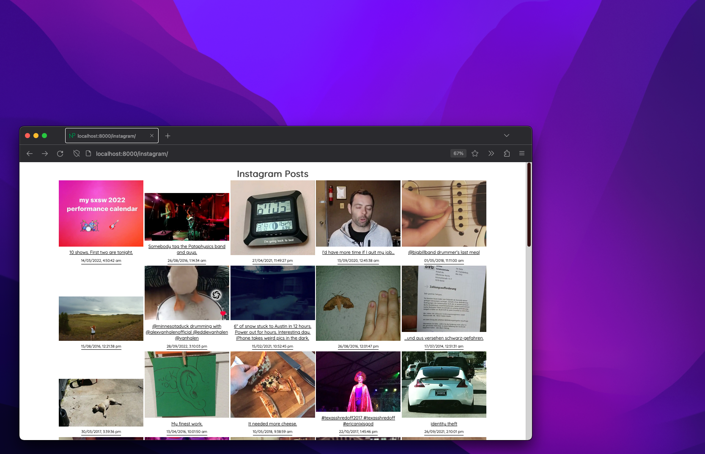

# Gatsby & instagram 
Do you want your Gatsby site to display your Instagram posts with images, captions, likes, comments and hashtags?

Check out my example here: [Instagram Gatsby Page](/instagram/)

In this blog post, I will show you how to create this example. We will leverage the existing [gatsby-source-instagram](https://www.gatsbyjs.com/plugins/gatsby-source-instagram/) plugin. 

## Limitations and FYI
This plugin allows you to source data from Instagram using either built-in scraping for user posts, hashtag pages and user profile scraping or [Graph API](https://developers.facebook.com/docs/instagram-api/). 
- The plugin will re-fetch for nodes every time the develop server is restarted, which means lots of requests repeat unnecessarily. This may cause performance issues or rate limits by Instagram. [Source](https://www.npmjs.com/package/gatsby-source-instagram)
- The [public scraping](https://www.gatsbyjs.com/plugins/gatsby-source-instagram/) method can only get the last 12 photos from an Instagram account or a hashtag page. It does not require an access token, but it may be blocked by Instagram if it detects too many requests from the same IP address.
- The [Graph API](https://www.gatsbyjs.com/plugins/@theowenyoung/gatsby-source-instagram/) method requires an access token and an instagram id. It can get more data than public scraping, such as likes, comments, hashtags, media type, etc. It also has a paginate parameter to control the limit of the API call and a maxPosts parameter to limit the maximum number of posts to store. 
- The plugin will use public scraping as a fallback if the Graph API throws any exception and the username is provided.
- If many sites that are served from the same domain are using the Instagram APIs, it may trigger Instagram to enforce rate limits for the domain. This may affect the availability of the plugin for those sites.

So, this is not a super reliable plugin but we shall let's see how it performs.

# Install and configure the plugin
To install the plugin, run the following command in your terminal:

```sh
  npm install --save gatsby-source-instagram
```

To configure the plugin, you need to provide your username, access token and instagram id as options in your gatsby-config.js file. You can also enable hashtags and pagination if you want. Here is an example of how to use the Graph API method:

```js

  // In your gatsby-config.js
  plugins: [
    {
      resolve: `gatsby-source-instagram`,
      options: {
        username: `username`,
        access_token: "a valid access token",
        instagram_id: "your instagram_business_account id",
        paginate: 100,
        maxPosts: 1000,
        hashtags: true,
      },
    },
  ]


```
## Getting your config details
I followed the current processes documented in the [plugin's github](https://www.gatsbyjs.com/plugins/gatsby-source-instagram/). For reference, I followed these steps:
### For public content scraping

If you intend to use the public scraping method then you need to pass the concerning username id.
You can determine it by taking the following steps:
1. Open a browser and go to the Instagram page of the user - e.g. https://www.instagram.com/user/
1. Right-click on the web page to open the right-click context menu and select Page Source / View page source / Show Page Source. Safari users, please make sure that the developer tools are enabled - see [Enabling Web Inspector - Apple Developer](https://developer.apple.com/library/archive/documentation/NetworkingInternetWeb/Conceptual/Web_Inspector_Tutorial/EnableWebInspector/EnableWebInspector.html)
1. Search for `profilePage_`. The number that follows is the username id. If you view the page source of https://www.instagram.com/user/, you will find `profilePage_8556131572`. So, `8556131572` is the username id of the username `user`.

<br/>

### For Graph API
If you intend to use Graph API for more reliability (note the plugin will fallback to public scrape if unsuccessful using Graph API and the username is set), there is some pain involved:

1. Created a Facebook page (I know... :/)
1. Create an [app](https://developers.facebook.com/apps/) ([register as a Meta dev](https://developers.facebook.com/docs/development/register) to do this)
1. Go to the [Graph API Explorer](https://developers.facebook.com/tools/explorer/)
    1. Select your Facebook app
    1. Add the following permissions: 
        - pages_manage_ads, 
        - pages_manage_metadata, 
        - pages_read_engagement, 
        - pages_read_user_content, 
        - pages_show_list, 
        - instagram_basic
    1. Generate the token so you are prompted to associate the Page target. 
    1. Select the Facebook page you created and allow access.
    1. Use the Graph API Explorer to make a GET request to `me/accounts`
    1. Copy the access_token in the response (we call this `temporary_token`)
    1. Click on the `id` next to `name` to change the explorer URL 
    1. Then append `?fields=instagram_business_account&access_token={access-token}` and do another GET request
    1. Save your `instagram_business_account.id`, this is your `instagram_id`
1. Lastly, go to the [Access Token Debugger](https://developers.facebook.com/tools/debug/accesstoken/):
    1. Paste your temporary_token and press "Debug"
    1. You should see this token now expires in 3 months
    1. Press "Extend Access Token" and press the new debug that appears next to the token
    1. You should see this token now never expires but sometimes 3 months is the maximum and the cause is not clear
    1. Copy this new token (we will call this `access_token`)

Now you will need to find a safe place to store your keys. If you're using GitHub or similar, you should use the secure variables settings for the project. 

Do not accidentally push these keys to a public repo. If that happens, immediately [revoke the keys by following this guide](https://developers.facebook.com/docs/permissions/reference#revoking).

### Graph API unsuccessful
I found that despite following the instructions, I was never able to successfully use the Graph API. I may revisit it in the future if I have a good reason but working in the Facebook dev area was a very disconnected and confusing experience. 

# Query the Instagram data
Query the Instagram data using GraphQL. You can use the allInstaNode query to get all the posts from your Instagram account. You can access fields such as id, caption, likes, comments, localFile (for image processing) and hashtags. Here is an example of how to query the data:

```graphql

query {
  allInstaNode {
    edges {
      node {
        id
        caption
        likes
        comments
        localFile {
          childImageSharp {
            gatsbyImageData(
              layout: CONSTRAINED, 
              placeholder: BLURRED
            )
          }
        }
        hashtags
      }
    }
  }
}


```

# Add the component to your site
There are 2 approaches you can take: 
- create the page using gatsby-node.js 
- create a react component

## Create via gatsby-node.js
You could use the createPage API in `gatsby-node.js` to programmatically create a page for your Instagram feed. You can also pass the Instagram data as context to the component. Here is an example of how to do that:

  ```js

    // In gatsby-node.js
    exports.createPages = async ({ graphql, actions }) => {
      const { createPage } = actions

      const result = await graphql(`
        query {
          allInstaNode {
            edges {
              node {
                id
                caption
                likes
                comments
                localFile {
                  childImageSharp {
                    gatsbyImageData(layout: CONSTRAINED, placeholder: BLURRED)
                  }
                }
                hashtags
              }
            }
          }
        }
      `)

      createPage({
        path: "/instagram-feed",
        component: require.resolve("./src/pages/instagram.js"),
        context: { instagramData: result.data.allInstaNode },
      })

    ```

## Create an Instagram component

Alternatively, you can add a react component and include the GraphQL directly in the same file. Here's an example of that: 

  ```jsx

      // In components or pages folder, create your instagram component
      import React from "react";
      import { useStaticQuery, graphql } from "gatsby";
      import { GatsbyImage } from "gatsby-plugin-image";

      const Instagram = () => {
        const data = useStaticQuery(graphql`
        query {
          allInstaNode {
            edges {
              node {
                id
                caption
                timestamp
                localFile {
                  childImageSharp {
                    gatsbyImageData
                  }
                }
              }
            }
          }
        }`);

        const styles = {
          container: {
            display: "flex",
            flexWrap: "wrap",
            justifyContent: "center",
            alignItems: "center",
          },
          node: {
            height: 300,
            width: 300,
            overflow: "hidden",
            display: "flex",
            flexDirection: "column",
            justifyContent: "end",
            alignItems: "center",
            margin: 2,
          },
          title: {
            textAlign: "center",
            margin: 16,
          },
          overlay: {
            background: "transparent"
          }
        };

        return (
          <div style={styles.title}>
            <h1>Instagram Posts</h1>
            <div style={styles.container}>
              {data.allInstaNode.edges.map(({ node }) => (
                <>
                  <a href={`https://www.instagram.com/p/${node.id}/`}>
                    <div key={node.id} style={styles.node}>

                      <GatsbyImage
                        image={node.localFile.childImageSharp.gatsbyImageData}
                        alt={node.timestamp}
                      />
                      <div style={styles.overlay}>
                        {node.caption}
                        {new Date(node.timestamp * 1000).toLocaleString()}
                      </div>

                    </div>
                  </a>
                </>
              ))}
            </div>
          </div>
        );
      };

      export default Instagram;


  ```

# Run the dev build
Run `gatsby develop` via your npm scripts and monitor the console. If you have settings for Graph API set, then you may see the fallback message if it fails to connect. This is what I saw each time:
```sh
  warn Could not get instagram posts using the Graph API. 
  Error status Error: Request failed with status code 400
  warn Falling back to public scraping... with 1234567892
```

# Render the results

Assuming you've named your react component or gatsby-node as 'instagram', we can now navigate to the path: `http://localhost:8000/instagram/`. 

If you are facing issues, double check your routing and gatsby-config. In my case, I needed to free up the instagram path due to how strict this project is regarding unwanted path creation.

On loading the page, you'll see the instagram posts for the user you're targetting:



Check out my example here: [Instagram Gatsby Page](/instagram/)

# Conclusion
In the end, this library does what it says on the tin. However, I think we would have more options and more resilient retrieval if we could incorporate the Graph API. It would make things even easier to have a premium account from what I understand. I'll be reading up on how free accounts can use facebook apps and hope to revisit with a future blog post where I address the issues faced here. 

Hope this was helpful. 