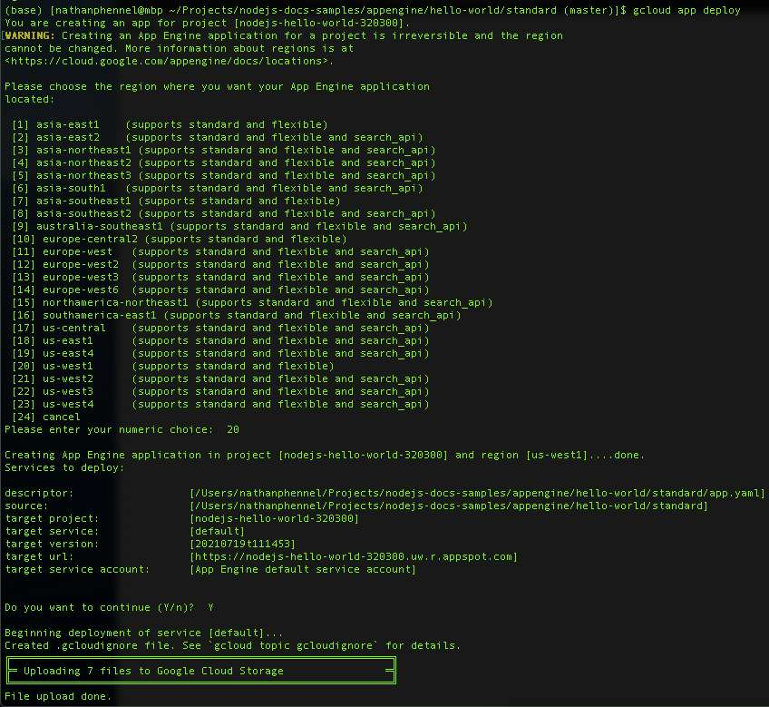
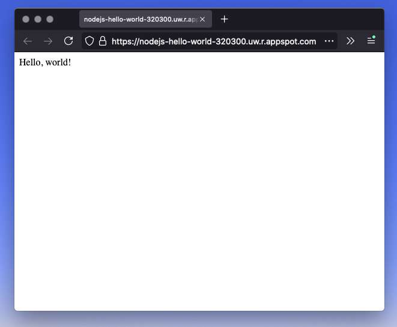

import { note } from "../../src/components/layout.module.css";

So, it's the first step in any new development environment: HELLO WORLD! 🙌

Deploying a node.js app on GCP standard environment is actually incredibly easy.

## Prereq steps
1. Installed and initialized `gcloud`
1. Successful login to gcloud
1. Billing is enabled on your gcloud account 🤑
1. Have a node.js app that runs :)
1. Enabled the [Cloud Build API](https://console.cloud.google.com/flows/enableapi?apiid=cloudbuild.googleapis.com)

## Steps to Deploy:
### Create the Project - via the terminal with 
    ```

    gcloud app create --project=[PROJECT_ID]


    ```

### Go to the node.js code directory or clone the Google example
    ```

    git clone https://github.com/GoogleCloudPlatform/nodejs-docs-samples


    ```

### Navigate to the Hello World app
    ```

    cd nodejs-docs-samples/appengine/hello-world/standard


    ```

### Install and Run the app locally
    ```

    npm install && npm start


    ```

### Deploy the app! - from the same root directory of the app, run
    ```

    gcloud app deploy
    

    ``` 
    then follow the prompts to select region, etc.

### View the app once it finished deploying
    ```

      gcloud app browse
      
    ```


<br/>
<div className={note}>
  <strong>Note:</strong> The default location for a deployment is: 
    ```
    
    https://PROJECT_ID.REGION_ID.r.appspot.com
    
    
    ```
   So you can either navigate there in your browser or you can use: 
    ```
    
    gcloud app browse
    
    
    ```
   The `app browse` arguments will prompt the shell to trigger the browser and open the page open for you.
</div>

# Conclusion
And you are done! Yes, it was actually that easy. Now, let's look into some additional features/capabilities of GCP + Node.js, like [GCP Datastore](../gcp-datastore/).