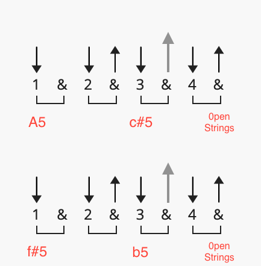
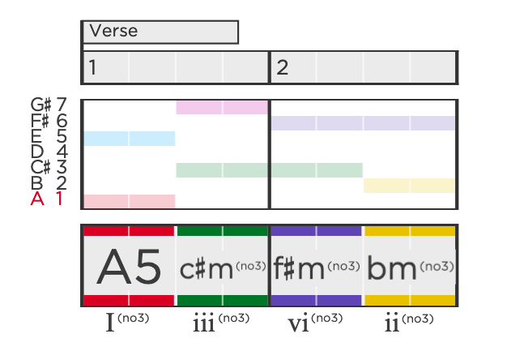
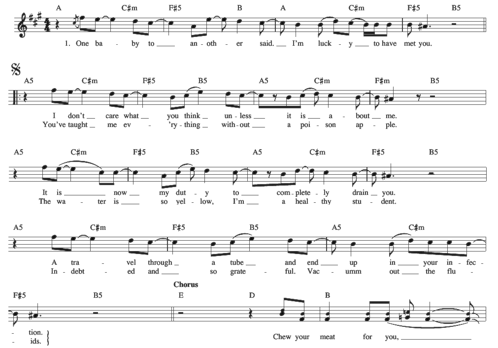
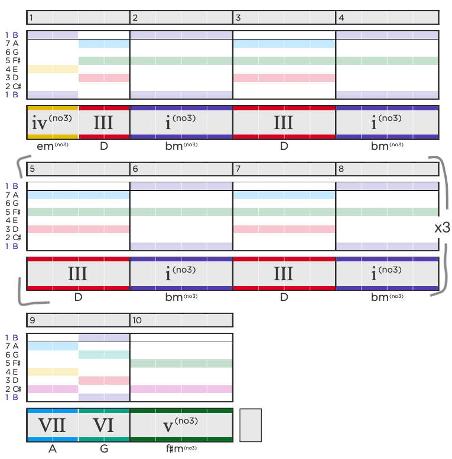
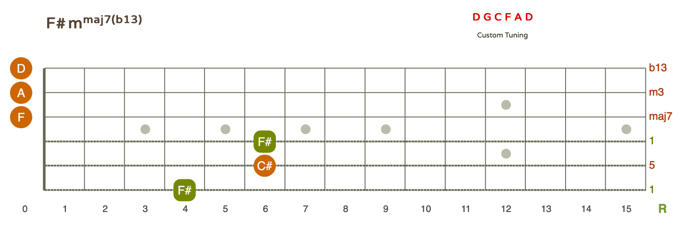

import Video from "../../src/components/video";
import Audio from "../../src/components/audio";
import slowVersion from "../../audio/nirvana - drain you (slowed).mp3"

# About the song
This track from Nevermind is arguably Nirvana at its best. Kurt Cobain loved this song and even once said, "I love the lyrics, and I never get tired of playing it... Maybe if it was as big as 'Teen Spirit', I wouldn’t like it as much." [-Rolling Stone interview](https://web.archive.org/web/20101031083301/http://www.rollingstone.com/music/news/51942/228308)

The lyrics appear to be about a codependent and toxic relationship. The narrator is obsessed with the other person, who drains him but also makes him feel lucky. The relationship is compared to a tube to infection, a kiss, and a vitamin, implying that it is addictive and consuming. The narrator also mentions a poison apple and yellow water, suggesting that the relationship is harmful and unhealthy.

<Video
  videoSrcURL="https://www.youtube.com/embed/lDTZpG0Hn6U?start=18"
  videoTitle="nirvana-drain-you"
/>

# Learn the song
To play it well, this song requires rhythm independence between singing and strumming riffs more than the average Nirvana tune. The melody of the chorus has a catchy hook, while the verses have a more complex vocal rhythmic pattern. 

The song was recorded in D standard tuning, but Nirvana often played it live in different tunings. For example, they frequently used E♭ standard tuning for many songs, so this song was sometimes performed that way too.

## Chords
Learning the chords is straightforward. The chords used indicate the key of B minor. 

But the chords A5, C#5, F#5 and B5 do not all fit into a single major or minor key. These are power chords, which consist of the root note and the fifth note of the scale. Power chords do not include the third note of the chord, which determines whether a chord is major or minor. As a result, power chords can be used in both major and minor keys. 

Some argue that the verses are in A major while the choruses are in D major (aka B minor).


## Song parts
The song has a common structure for Nirvana: 

- [Verse 1] > [____Chorus____] > 
- [Verse 2] > [____Chorus____] > 
- [Break] > [Instrumental] > 
- [Verse 1] > [____Chorus____]

Note that the Instrumental section is just the verse with no vocals. 

Let's look at each individual section in detail:

### Verse
If you listen closely, you may notice that the rhythm of the verse is similar to that of 'Aneurysm' from Incesticide. Here's how to strum it:



To match the style, note the accents on the '&' of 3. On top of this, the '&' of 4 is usually a sort of gap between chords and the open strings can be heard briefly. 

If you're playing this slow, it will not sound very musical so in those instances, you can begin the f#5 and A5 chords a half-beat early to reign in the chaos. 

As a variation, you can skip the 3rd chord and mute the strings.

From a diatonic perspective, if we assume that we are in the key of A major in the verses, the verse chord pattern looks like this (I-iii-vi-ii):



To my knowledge, the I-iii-vi-ii chord progression is somewhat unique and not a typical pop song progression but it still has some nice harmonic pull to it. 

"The New" by Interpol uses I-iii-vi-ii throughout the whole song but its in the key of C major:
<Video
  height="100"
  videoSrcURL="https://www.youtube.com/embed/hI5IVvUc9Rc"
  videoTitle="The New by Interpol"
/>

<br/>
#### Lyrics & Melody
Kurt Cobain uses heavy words and a wide range on this track. He modifies his vocal timbre for each section so learning this song gives you the opportunity to explore your vocal delivery using techniques like vocal fry and distortion.

The melody for verses is really worth examining because of the more intricate delivery: 


<br/>

### Chorus
Tho chorus is basically 2 chord vamp but with an introduction chords as well as a cadence to finish it off.



### Break
A commong one-chord build is performed for the break in this song. The noisier harmonies can be achieved by playing the f# chord shape with only the top 3 strings of the guitar (a power chord) and then leaving the bottom strings open so they ring and include the flat 6 (D) note which gives it a forboding sound.

I think this chaos chord could be described as F♯m(maj⁷) (♭¹³). It uses altered extensions b9, #9 and b13. These are causing strong dissonance alongside the major 7th (maj7). Dissonance Warning! 



# Practice the song
I recommend getting a copy of the song into your DAW. I usually use Logic's Varispeed feature to quick adjust to a tempo slower/faster so I can learn the song. Once you're able to play it back to front with ease, its time to move on. 

## Practice Track
For more assistance when practicing, play and sing along to the track slowed down. This is effective when learning but don't forget to practice without it. 

<Audio
  src={slowVersion}
  text="Practice along with the track slowed down:"
/>

I highly recommend practicing slowly and deliberately, ideally with a metronome. 

## Guitar Tabs
This complete tab will guide you to play the entire song. Don't forget to check out the practice track to play along with.

```yaml

  Song: Drain You
  Artist: Nirvana
  Album: Nevermind
  
  Tuning: 	D G C F A D
  Key:  A major verse,	B minor chorus

  [Verse 1]
  A5      C#5  F#5  B5  A5         C#5       F#5     B5
    One baby to another says I'm lucky to have met you...
  
  A5      C#5  F#5       B5     A5        C#5          F#5
  I don't care what you think unless it is about me
  
  A5     C#5     F#5 B5 A5     C#5       F#5   B5
      It is now my duty to completely drain you
  
  A5     C#5      F#5     B5      A5   C#5        F#5    B5
    I travel through a tube and end up in your infection
  
  [Chorus]
  E D      B
        Chew your meat for you.
  
  D         B
  Pass it   back and forth
  
  D         B
  In a      passionate kiss
  
  D         B
  From my   mouth to yours,
  
  A G    F#
  I like you...
  
  [Verse 2]
  A5     C#5  F#5   B5 A5      C#5    F#5    B5
    With eyes so dilated, I've become your pupil
  
  A5      C#5  F#5      B5     A5        C#5    F#
    You've taught me everything Without a poison apple
  
  A5      C#5   F#5   B5    A5      C#5     F#5  B5
    The water is so yellow, I'm a healthy student
  
  A5   C#5     F#5     B5        A5   C#5       F#5   B5
    Indebted and so grateful - Vacuum out the fluids
  
  [Chorus]
  E D      B
        Chew your meat for you.
  
  D         B
  Pass it   back and forth
  
  D         B
  In a      passionate kiss
  
  D         B
  From my   mouth to yours,
  
  A G    F#
  I like you...
  
  [Break]
  F#5  and also F♯m(maj⁷) (♭¹³)
  You....   (x5)
  
  [Instrumental]
  A5      C#5 F#5    B5   A5         C#5        F#5      B5
  
  A5      C#5 F#5    B5   A5         C#5        F#5      B5
  
  [Verse 1]
  A5      C#5  F#5  B5  A5         C#5       F#5     B5
    One baby to another says I'm lucky to have met you...
  
  A5      C#5  F#5       B5     A5        C#5          F#5
  I don't care what you think unless it is about me
  
  A5     C#5     F#5 B5 A5     C#5       F#5   B5
      It is now my duty to completely drain you
  
  A5     C#5      F#5     B5      A5   C#5        F#5    B5
    I travel through a tube and end up in your infection
  
  [Chorus]
  E D      B
        Chew your meat for you.
  
  D         B
  Pass it   back and forth
  
  D         B
  In a      passionate kiss
  
  D         B
  From my   mouth to yours,
  
  D         B
  Sloppy lips to lips
  
  D         B
  You're my vitamins
  
  A G    F#
  I like you...


```
