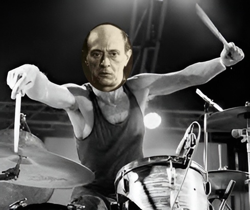
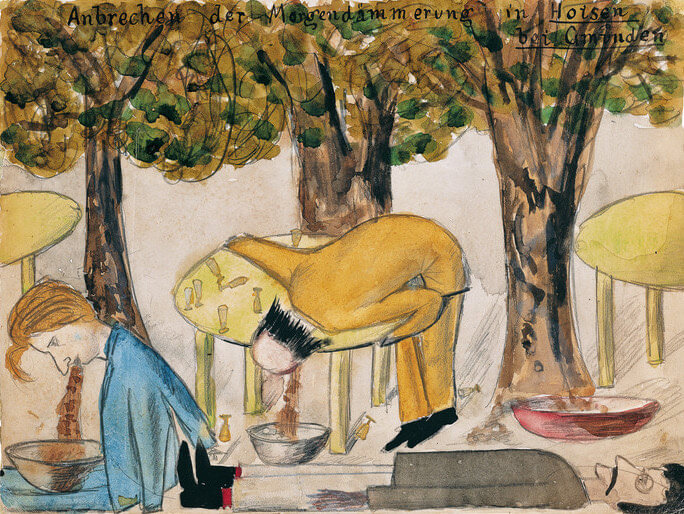
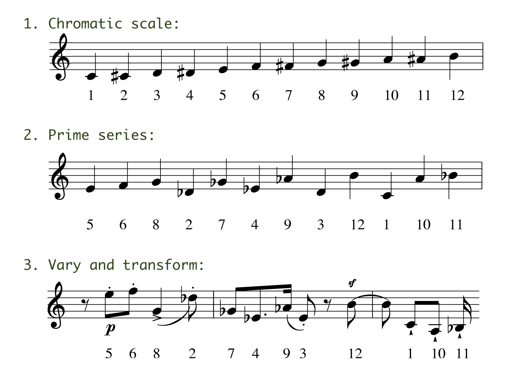

import Playlist from "../../src/components/playlist/index.js";

# 12-tone technique: a revolutionary method of musical composition
What if you could compose music without relying on the conventional rules of melody and harmony? What if you could create a new musical language that is free from the constraints of tonality and tradition? That is what Arnold Schoenberg strived to achieve when he devised the 12-tone technique, a revolutionary method of musical composition that changed the course of modern music.

Prior to Schoenberg, romantic composers of the 19th century had pushed the boundaries of tonality and harmony. Schoenberg wanted to go further and create a new musical logic to liberate composers from the tyranny of the major-minor system. 

Instead of using melody and harmony as the main musical tools, Schoenberg used rhythm and dynamics to create contrast and tension in his music. 

I personally think Schoenberg could've done well behind a drum kit. 



# More about Schoenberg
Schoenberg was a painter, a teacher, and a writer in addition to composing. During the turn of the 20th century, he was a leading figure in the avant-garde movement. He was also a controversial figure, and his music was considered too radical for most people at the time.

## Schoenberg's paintings
Before he was a composer, Schoenberg was a painter. He even talked frequently about the similarities between painting and music. 

This painting, called “Day Break in Hoisen Near Gmunden”, shows a scene of drunken revelry on a summer day. It appears Schoenberg depicted himself as the person vomiting under the table:




## Letter to a student
Schoenberg was also a teacher and [his students](https://en.wikipedia.org/wiki/Category:Pupils_of_Arnold_Schoenberg) included Alban Berg, Anton Webern, Hanns Eisler, Egon Wellesz, Nikos Skalkottas, and later John Cage, Lou Harrison, Earl Kim, Leon Kirchner, and many other prominent composers.

He was known to be a demanding teacher often writing letters to students. For example, in one letter to a student, he wrote: 
  
  ```

    Dear Jalowetz,
    I was very angry with you. Your not writing seemed grossly neglectful.
    For I consider I have a claim to be the first person my puplls inform 
    of their artistic activities. Perhaps after all a teacher's sole reward 
    for his efforts is liking to ascribe his pupils' successes in some 
    degree to himself! But your not writing also has an obverse: not wanting 
    to hear from the other person. This is very nearly insulting!

    But I mean to give you the benefit of the doubt because I know you are 
    a good chap. Still, you ought to get into the habit of giving a sign of 
    life from time to time. Of course for you it may be a sufficient sign 
    of life to feel yourself breathing - but do breathe a bit for others 
    as well...


  ```
I hope Jalowetz wrote back to him. 😬

## Religion and escaping the Nazis
Interestingly, in 1898, Schoenberg [converted to Christianity but then re-converted to Judaism in 1933](https://www.schoenberg.at/index.php/en/arnold-schoenberg-und-sein-gott-2). It's beleived his re-conversion was a political statement in response to the rise of Nazism in Germany. 

The story goes that while on vacation in France in 1933, Schoenberg warned that returning to Germany would be dangerous, so he decided to move to the United States. That year, he changed the spelling of his name (from 'Schönberg' to 'Schoenberg') and eventually settled in Los Angeles, where he taught at the University of Southern California and the UCLA, and continued to compose.

# How 12-tone technique works
Composition of a twelve-tone work proceeds from a chosen row of the twelve notes of the chromatic scale (called the prime series) and may be manipulated in many ways, including its transpositions, inversions, and retrogrades. The following rules are generally expected to be followed:
- Use all 12 chromatic notes once
- No repeats until all notes used (except trills, etc.)
- Series can be inverted, retrograded, or both
- No reordering of notes in series

The prime series of the chromatic scale is a set of notes that contains all twelve notes of the chromatic scale, arranged in a particular order.



The row may be subjected to interval-preserving transformations - transposition, inversion, and retrograde - which may be applied to the prime series itself or to any of its derived forms.

Can you hear the prime series in the following pieces?

# The Playlist
<Playlist
  apple="https://embed.music.apple.com/au/playlist/twelve-tone-technique/pl.u-aZb0YMDFy5jd0B"
  youtube="https://www.youtube.com/embed/videoseries?si=AQqAJZXn-hT50nTn&amp;list=PLgOi5oduaFrmcxElDjd0XEoYOQ-zjE-eV"
  title={"'🎼 Twelve Tone Technique"}
/>

# Thanks for listening
I hope you got something out of this alternative approach to composing music. Sadly, I think Schoenberg would be disappointed to see that his music is still considered too radical for most people today.

It can be a challenging listening experience. But, while it may be considered hard to like, it's impossible to ignore or forget this music.

{/* # Share feedback component*/}
{/* TODO:  */}