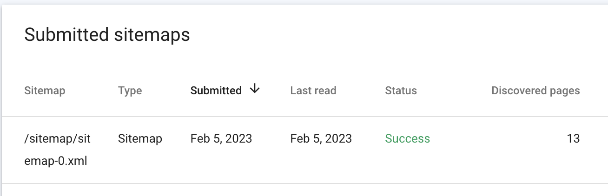

Today, I'll be following along the [Gatsby SEO guide](https://www.gatsbyjs.com/docs/how-to/adding-common-features/adding-seo-component/#seo-with-gatsby). I'll be following these steps:

1. Gauging my current situation
1. Adding siteMetadata
1. Create a sitemap generation process
1. Create robots.txt generation process

After these steps, I'll do some testing to see if my SEO has improved using Google.

# Gauging my current situation
Unfortunately, this blog is yet to be indexed. Instead of waiting, I'll use the Google search console to verify the site.

To use the search console, I've got to add a meta tag to the site for verification purposes.

After deploying the blog which now contains the verification tag, I was successfully able to verify ownership. Now, Google will spend some time crawling the site here at /blog and indexing all the things.

I'll check the results when I look at this again in the next few days.

...next day, I'm noticing the same issues with Search Console, says more time is needed essentially. In the meantime, I'll continue on my optimization journey.

# Adding siteMetadata
This was simple. In the `gatsby-config.js`, I just ensure the following properties were set:
```javascript

  siteMetadata: {
    title: "Nathan Phennel's Blog",
    description: "Notes and memos on the things that cross my path.",
    siteUrl: `https://enphnt.github.io/blog/`,
    image: "/images/profile-pic.png"
  },


```

After this stage, I tested google and still no changes were detected. I continued to optimize in other ways.

# Create a sitemap generation process
So one major issue I face is that Googlebot doesn't seem to know how to crawl the site. I understand that if provided a sitemap.xml then the bot will have a much better chance of successfully crawling. Sitemaps are also great to prevent the crawling of certain areas that you wouldn't want to be indexed, like 404 pages, paths with hashes for individual user sessions, etc.

So I grabbed the `gatsby-plugin-sitemap` and was able to configure it with minimal configuration. Essentially, I had to leverage the `serialize` option so that I could append the /blog/ part of the path to all my pages. This is due to the way github pages hosts subproject. This blog is a subproject or subfolder of my main github-pages project. So by default, the paths were defaulting to `enphnt.github.io/post-name` whereas after using the `serialize` option, I was able to set each entry to be `enphnt.github.io/blog/post-name`.

I updated the build and deployed it.

Next, I went back to Search Console to see if anything had changed. Nothing. This time, I decided to do 2 things:
1. request indexation - It's just a click to request it. Still pending of course...
1. explicitly tell Google where to find the sitemap. This is done in the 'sitemap' section of the Search Console.

After this, I was able to see that Googlebot was assisted finally (note, currently 12 posts on this blog):

    

This is great. Now, when I run a new production build of the site, a new sitemap.xml is generated too so that all new content is included in the sitemap.

I didn't tweak the sitemap attributes much. Just gave the homepage, or /blog/, path a slightly higher priority. I set the changefreq to be monthly because realistically that's what I've maintained at best so far.

You can access the sitemap here by the way: https://enphnt.github.io/blog/sitemap/sitemap-0.xml

Next to the robots.txt file...

# Create robots.txt generation process
Very similar to the sitemap plugin, I found one got robots, `gatsby-plugin-robots-txt`. I included the plugin middleware and proceed to review the generated robots.txt file.

Unfortunately, I face the same issues as before with the github-pages subproject, aka /blob/ in the path.

Original output point the bots to go here for the sitemap:
```

Sitemap: https://enphnt.github.io/blog/sitemap/sitemap-0.xml


```

To ensure this was created correctly, I simply hardcoded the locations of things:
```javascript

options:
    {
        host: 'https://enphnt.github.io/blog', // truncated in the robots.txt result?
        sitemap: 'https://enphnt.github.io/blog/sitemap/sitemap-0.xml',
        policy: [{ userAgent: '*', allow: '/' }],
    }


```

After this, I was able to see that indeed, the file was in place, waiting for future bot visits:
https://enphnt.github.io/blog/robots.txt

Now, in future production builds of the site, the robots.txt will be generated and made available for all those friendly crawlers.

# Testing
It was great to get the feedback immediately from Search Console when I popped in the sitemap.xml. However, still, I'm unable to see the site in Google search itself.

I'll continue waiting and check back soon...

## Update after a few days
I've noticed that still the child pages of the site are not being detected by Google search. I've decided to address this by registering ownership of the main site at https://enphnt.github.io.

I used the meta tag option to verify ownership successfully.

I then actually requested indexing on the 3 most recent blog post urls themselves.

In a few days, hopefully, I will start to see the bots crawl all the articles successfully.

# Conclusion
...tbd