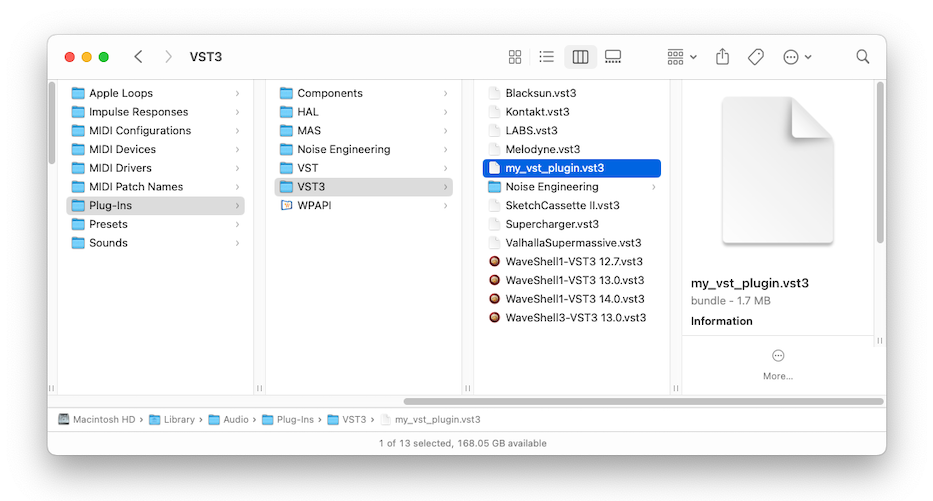
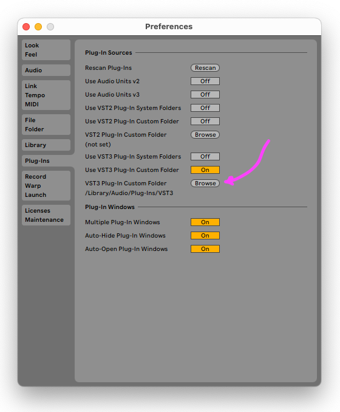

import { Link } from "gatsby";
import { note } from "../../src/components/layout.module.css";
import ableton from "./ableton-my-vst.gif"
import build from "./build-bundle.gif"

# Do it yourself
I've written previously about <Link aria-label="vst-plugins" to={"/blog/vst-plugins/"} children={`how to build your own custom VSTs at a high-level`} /> but I wanted to actually implement something so I dedicated a weekend to finding out how to do it. I'm going to share the resources I found and the process I followed so that you can build your own VST. 

I'll also share some of the pitfalls and surprises that I learned along the way like how Apple has their own proprietary format (Audio Units) and how this could be handled programitically to support both VST and AU formats from a single codebase.

# VST libs and tools
Here are some libraries and tools that are awesome for creating VSTs. I’ll tell you what they do and why they rock, but remember that there are many more out there.
## [steinberg's VST3 SDK](https://github.com/steinbergmedia/vst3sdk)
The official <i>proprietary</i> SDK for developing VSTs from Steinberg, the company that created the VST format. It's written in C++ and is the most complete and maintained project I can find for VST development.

Some concerns I have with Steinberg's offering include the fact that it's written in C++ (steep learning curve) and that it's not open source. If I ever decided to sell my plugins developed on I'd have to follow very strict guidelines on including the official VST logo and other branding requirements. No thanks. 

## [JUCE](https://github.com/juce-framework/JUCE)
A powerful C++ framework that lets you build cross-platform audio plugins and apps with ease. It supports multiple plugin formats, such as VST, AUv2, AUv3, AAX, and LV2, and provides a rich set of features, such as audio processing, graphics, GUI, MIDI, networking, and more. JUCE is widely used by professional developers and companies, such as Korg, ROLI, and Native Instruments.

Interestingly, JUCE users tiers to determine your license:
  - Personal (for developers or startup businesses with revenue under the 50K USD Revenue Limit; free)
  - Indie (for small businesses with under 500K USD Revenue Limit; $40/month)
  - Pro (no Revenue Limit; $130/month)
  - Educational (no Revenue Limit; free for bona fide educational institutions)

But C++ is a steep learning curve for me.

## [iPlug2](https://github.com/iPlug2/iPlug2)
Open-source C++ library that provides a framework for building cross-platform audio plugins. It supports multiple plugin APIs, such as VST2, VST3, AUv2, AUv3, AAX and WAM, with the same minimalistic code. There is an interesting [starter project](https://github.com/iPlug2/iPlug2OOS) which is maintained as an excellent form of documentation. 

While iPlug2 appears to be a far less limiting alternative to Steinberg's SDK as it would product bundles for all types DAWs from a single implementation. However, it requires C++ code which is new to me so I searched for a Rust alternative.

## [nih-plug](https://github.com/robbert-vdh/nih-plug)
Open-source Rust wrapper for the `iPlug2` library. I'll be using this library in my example here.

In the end, I selected the `nih-plug` because it's open source, supports VST (which is all I thought I needed at the time), and is written in Rust which I'm interested in learning more about. I'll share my code and the steps to get up and running next.

# How to make your own VST
I found the `nih-plug` Rust library to be the lowest barrier to entry without limiting distribution options in future. You can get a basic VST example project up and running in about 20 mins. 

<ul className={note}>
  <h4>Why Rust?</h4>
  <p>
    Javascript support in VSTs is still in its infancy. JS is limited in many ways too like the fact that it's single-threaded and has no support for multithreading. Rust, on the other hand, appears to be a great language for audio processing and I found a lot of support for VST development. 
  </p>
  <p>
    It should be noted that traditionally, VSTs are written in C++ but I found Rust is recommended to be a great alternative for the uninintiated.
  </p>
</ul>

## Install Rust
You can install Rust by following the instructions on their website but I recommend using `rustup` which is a tool for managing Rust versions and toolchains. On macos, you can install `rustup-init` (yes, that name is correct) via `brew` by running the following command in your terminal:

  ```bash

  brew install rustup-init
  rustup-init # this will install the latest stable version of Rust


  ```

## Create a new Rust project
Create a new Rust project with Cargo (Rust's package manager) by running the following command in the terminal: 

```bash

cargo new my_vst_plugin --lib


```

This creates a folder for the new project called `my_vst_plugin`. You can change the name of your project to whatever you want.

## Add the nih-plug library to your project
Add the following lines to your `Cargo.toml` file under the `[dependencies]` section:

  ```toml

  [dependencies]
  nih_plug = { git = "https://github.com/robbert-vdh/nih-plug.git", features = ["assert_process_allocs"] }
  parking_lot = "0.12"
  
  
  ```

The `parking_lot` dependency is used by the example project's implementation, so it's also necessary to add it to your project for this specific example.

## Implement the VST logic
Implement your plugin's logic by editing the `src/lib.rs` file in the `my_vst_plugin` folder. 

This example is a Gain plugin that multiplies the input signal by a gain value. It's a simple example but it's a great starting point for understanding how to build a VST. 

You can try any of the examples in the `nih-plug` repo. Just ensure you update the `Cargo.toml` file to include any dependencies that are required by the example you choose. You can then essentially copy/paste the example's `src/lib.rs` file into your project's `src/lib.rs` file.

I'll paste the implementation I went with below. The devs over at `nih-plug` have event added detailed comments to explain what's going on:

  ```rust
    
  use nih_plug::prelude::*;
  use parking_lot::Mutex;
  use std::sync::Arc;

  struct Gain {
      params: Arc<GainParams>,
  }

  /// The [`Params`] derive macro gathers all of the information needed for the wrapper to know about
  /// the plugin's parameters, persistent serializable fields, and nested parameter groups. You can
  /// also easily implement [`Params`] by hand if you want to, for instance, have multiple instances
  /// of a parameters struct for multiple identical oscillators/filters/envelopes.
  #[derive(Params)]
  struct GainParams {
      /// The parameter's ID is used to identify the parameter in the wrapped plugin API. As long as
      /// these IDs remain constant, you can rename and reorder these fields as you wish. The
      /// parameters are exposed to the host in the same order they were defined. In this case, this
      /// gain parameter is stored as linear gain while the values are displayed in decibels.
      #[id = "gain"]
      pub gain: FloatParam,

      /// This field isn't used in this example, but anything written to the vector would be restored
      /// together with a preset/state file saved for this plugin. This can be useful for storing
      /// things like sample data.
      #[persist = "industry_secrets"]
      pub random_data: Mutex<Vec<f32>>,

      /// You can also nest parameter structs. These will appear as a separate nested group if your
      /// DAW displays parameters in a tree structure.
      #[nested(group = "Subparameters")]
      pub sub_params: SubParams,

      /// Nested parameters also support some advanced functionality for reusing the same parameter
      /// struct multiple times.
      #[nested(array, group = "Array Parameters")]
      pub array_params: [ArrayParams; 3],
  } 

  #[derive(Params)]
  struct SubParams {
      #[id = "thing"]
      pub nested_parameter: FloatParam,
  }

  #[derive(Params)]
  struct ArrayParams {
      /// This parameter's ID will get a `_1`, `_2`, and a `_3` suffix because of how it's used in
      /// `array_params` above.
      #[id = "noope"]
      pub nope: FloatParam,
  }

  impl Default for Gain {
      fn default() -> Self {
          Self {
              params: Arc::new(GainParams::default()),
          }
      }
  }

  impl Default for GainParams {
      fn default() -> Self {
          Self {
              // This gain is stored as linear gain. NIH-plug comes with useful conversion functions
              // to treat these kinds of parameters as if we were dealing with decibels. Storing this
              // as decibels is easier to work with, but requires a conversion for every sample.
              gain: FloatParam::new(
                  "Gain",
                  util::db_to_gain(0.0),
                  FloatRange::Skewed {
                      min: util::db_to_gain(-30.0),
                      max: util::db_to_gain(30.0),
                      // This makes the range appear as if it was linear when displaying the values as
                      // decibels
                      factor: FloatRange::gain_skew_factor(-30.0, 30.0),
                  },
              )
              // Because the gain parameter is stored as linear gain instead of storing the value as
              // decibels, we need logarithmic smoothing
              .with_smoother(SmoothingStyle::Logarithmic(50.0))
              .with_unit(" dB")
              // There are many predefined formatters we can use here. If the gain was stored as
              // decibels instead of as a linear gain value, we could have also used the
              // `.with_step_size(0.1)` function to get internal rounding.
              .with_value_to_string(formatters::v2s_f32_gain_to_db(2))
              .with_string_to_value(formatters::s2v_f32_gain_to_db()),
              // Persisted fields can be initialized like any other fields, and they'll keep their
              // values when restoring the plugin's state.
              random_data: Mutex::new(Vec::new()),
              sub_params: SubParams {
                  nested_parameter: FloatParam::new(
                      "Unused Nested Parameter",
                      0.5,
                      FloatRange::Skewed {
                          min: 2.0,
                          max: 2.4,
                          factor: FloatRange::skew_factor(2.0),
                      },
                  )
                  .with_value_to_string(formatters::v2s_f32_rounded(2)),
              },
              array_params: [1, 2, 3].map(|index| ArrayParams {
                  nope: FloatParam::new(
                      format!("Nope {index}"),
                      0.5,
                      FloatRange::Linear { min: 1.0, max: 2.0 },
                  ),
              }),
          }
      }
  }

  impl Plugin for Gain {
      // You reference fields from the `Cargo.toml` file here
      const VENDOR: &'static str = env!("CARGO_PKG_AUTHORS");
      const NAME: &'static str = env!("CARGO_PKG_NAME");
      const VERSION: &'static str = env!("CARGO_PKG_VERSION");
      const URL: &'static str = env!("CARGO_PKG_HOMEPAGE");
      const EMAIL: &'static str = "info@example.com";


      // The first audio IO layout is used as the default. The other layouts may be selected either
      // explicitly or automatically by the host or the user depending on the plugin API/backend.
      const AUDIO_IO_LAYOUTS: &'static [AudioIOLayout] = &[
          AudioIOLayout {
              main_input_channels: NonZeroU32::new(2),
              main_output_channels: NonZeroU32::new(2),

              aux_input_ports: &[],
              aux_output_ports: &[],

              // Individual ports and the layout as a whole can be named here. By default these names
              // are generated as needed. This layout will be called 'Stereo', while the other one is
              // given the name 'Mono' based no the number of input and output channels.
              names: PortNames::const_default(),
          },
          AudioIOLayout {
              main_input_channels: NonZeroU32::new(1),
              main_output_channels: NonZeroU32::new(1),
              ..AudioIOLayout::const_default()
          },
      ];

      const MIDI_INPUT: MidiConfig = MidiConfig::None;
      // Setting this to `true` will tell the wrapper to split the buffer up into smaller blocks
      // whenever there are inter-buffer parameter changes. This way no changes to the plugin are
      // required to support sample accurate automation and the wrapper handles all of the boring
      // stuff like making sure transport and other timing information stays consistent between the
      // splits.
      const SAMPLE_ACCURATE_AUTOMATION: bool = true;

      // If the plugin can send or receive SysEx messages, it can define a type to wrap around those
      // messages here. The type implements the `SysExMessage` trait, which allows conversion to and
      // from plain byte buffers.
      type SysExMessage = ();
      // More advanced plugins can use this to run expensive background tasks. See the field's
      // documentation for more information. `()` means that the plugin does not have any background
      // tasks.
      type BackgroundTask = ();

      fn params(&self) -> Arc<dyn Params> {
          self.params.clone()
      }

      // This plugin doesn't need any special initialization, but if you need to do anything expensive
      // then this would be the place. State is kept around when the host reconfigures the
      // plugin. If we do need special initialization, we could implement the `initialize()` and/or
      // `reset()` methods

      fn process(
          &mut self,
          buffer: &mut Buffer,
          _aux: &mut AuxiliaryBuffers,
          _context: &mut impl ProcessContext<Self>,
      ) -> ProcessStatus {
          for channel_samples in buffer.iter_samples() {
              // Smoothing is optionally built into the parameters themselves
              let gain = self.params.gain.smoothed.next();

              for sample in channel_samples {
                  *sample *= gain;
              }
          }

          ProcessStatus::Normal
      }

      // This can be used for cleaning up special resources like socket connections whenever the
      // plugin is deactivated. Most plugins won't need to do anything here.
      fn deactivate(&mut self) {}
  }

  impl ClapPlugin for Gain {
      const CLAP_ID: &'static str = "com.moist-plugins-gmbh.gain";
      const CLAP_DESCRIPTION: Option<&'static str> = Some("A smoothed gain parameter example plugin");
      const CLAP_MANUAL_URL: Option<&'static str> = Some(Self::URL);
      const CLAP_SUPPORT_URL: Option<&'static str> = None;
      const CLAP_FEATURES: &'static [ClapFeature] = &[
          ClapFeature::AudioEffect,
          ClapFeature::Stereo,
          ClapFeature::Mono,
          ClapFeature::Utility,
      ];
  }

  impl Vst3Plugin for Gain {
      const VST3_CLASS_ID: [u8; 16] = *b"GainMoistestPlug";
      const VST3_SUBCATEGORIES: &'static [Vst3SubCategory] =
          &[Vst3SubCategory::Fx, Vst3SubCategory::Tools];
  }

  nih_export_clap!(Gain);
  nih_export_vst3!(Gain);


  ```

## Setup bundling and building
Normally, in Rust, projects are built by running `cargo build` in the terminal. However, we want to produce a specific filetype, or bundle a VST, so we need to first add some configuration to the `Cargo.toml` file to enable building and bundling.

We will eventually build <i>and bundle</i> using this command:
  
  ```bash

  cargo xtask bundle my_vst_plugin --release


  ```

The build command is running a Cargo subcommand called `xtask` to enable bundling. 

Here's a step by step guide on how to add `xtask`, a Rust subcommand that can help you with building and bundling your nih-plug projects:

1. Create a new binary package named `xtask` in your project directory by running the following command:
    ```bash
    # from your project directory run: 

    cargo new --bin xtask


    ```
1. Add the `xtask` package to the members list in your workspace `Cargo.toml` file. This will make the `xtask` package part of your workspace and allow you to run it with cargo. You can do this by editing the `Cargo.toml` file and adding the following lines:
    ```toml
    # in my_vst_plugin/Cargo.toml :

    [workspace]
    members = [
        "xtask",
    ]
    
    
    ```
1. Add the `nih_plug_xtask` dependency to the `xtask` package's `Cargo.toml` file. This will allow you to use the `nih_plug_xtask` library, which provides the implementation of the `xtask` command. You can do this by editing the `xtask/Cargo.toml` file and adding the following line:
    ```toml
    # in my_vst_plugin/xtask/Cargo.toml:

    [dependencies]
    nih_plug_xtask = { git = "https://github.com/robbert-vdh/nih-plug.git" }
    
    
    ```
1. Call the `nih_plug_xtask::main()` function from the `xtask` package's `main.rs` file. This will delegate the execution of the `xtask` command to the `nih_plug_xtask` library. You can do this by editing the xtask/src/main.rs file and replacing its content with the following code:
    ```rust
    // in my_vst_plugin/xtask/src/main.rs:

    fn main() -> nih_plug_xtask::Result<()> {
        nih_plug_xtask::main()
    }
    
    
    ```
1. Create a .cargo/config.toml file in your project directory and add an alias for the `xtask` command. This will allow you to run the `xtask` package with a shorter command: `cargo xtask`. You can do this by creating the .cargo/config.toml file and adding the following lines:
    ```toml
    # in my_vst_plugin/.cargo/config.toml:

    [alias]
    xtask = "run --package xtask --release --"
    
    
    ```
1. Now you can use the `cargo xtask` command to run the `xtask` package and access its subcommands, such as `bundle`.

## Build the project
Now that we're all setup, let's build the project by running the following command in the terminal from the `my_vst_plugin` folder:

  ```bash

  cargo xtask bundle my_vst_plugin --release


  ```

  <div style={{display: "flex", justifyContent: "center", margin: ".5em"}}>
    
  </div>


  This will produce 2 files: 
  - `target/bundled/my_vst_plugin.vst3`
  - `target/bundled/my_vst_plugin.clap`. 
  
  The second file generated is of the CLever Audio Plug-in or "CLAP" format. It's a newer and extended alternative to the VST format. CLAP supports MIDI fully, is cross-platform like VST except it's open source and tries to overcome the legal limitations of the proprietary VST format. You can read more about it [CLAP format](https://u-he.com/community/clap/) but so far, its in early stages and has limited support. 
  
  Anyway, let's test the VST3 file in a DAW and see if it works.

# Test your VST locally
Alright, let's get to the good stuff. 

To try out your shiny new VST, you'll need a DAW. I use Logic Pro X, so I was in for a rude awakening when I learned that Apple has its own special snowflake format called [Audio Units](https://developer.apple.com/library/archive/samplecode/sc2195/Introduction/Intro.html#//apple_ref/doc/uid/DTS40013969-Intro-DontLinkElementID_2). 

So, to test the VST, ensure you use a DAW that actually support it:
- [Reaper](https://www.reaper.fm/): the grim harvester of souls and sounds
- [Ableton Live Lite](https://www.ableton.com/en/products/live-lite/): the diet version of the popular live performance software
- [Cakewalk](https://www.bandlab.com/products/cakewalk): the resurrected zombie of the once-dead Sonar
- [Tracktion Waveform](https://www.tracktion.com/products/waveform-free): a free DAW that seems cool but I haven't tried it yet

I'm usually using Logic Pro X these days but I hear great things about Ableton so I decided to give it a try.

## Move the VST to the correct folder
Before even opening up the DAW, we need to put the VST in place for the DAW to find. On mac, I noticed that Logic already uses the folder at `/Library/Audio/Plug-Ins/VST3` so I moved the new VST there. 



## Configure Ableton to find the VST
Open Ableton and go to Settings and specify the folder where you put the VST.



## Find you plugin in the DAW
Open the DAW and create a new project. 

Click on a track and then on the left choose 'Plug-Ins' within Ableton's browser. You should see your plugin listed there based on the VENDOR and NAME you specified in the `lib.rs` file.

  <div style={{display: "flex", justifyContent: "center", margin: ".5em"}}>
    
  </div>

Drag it into the track and you should see the plugin's UI appear. 

Now, take a stab at modifying parameters and see if you can hear the difference. 

# Conclusion
This was a fun project and I learned a lot about VSTs and how to build them.

One caveat that I did not see coming was the fact that Logic, or rather Apple, doesn't support VSTs. They have their own proprietary format called Audio Units. I'm not sure if this is a good thing for developers. 

In a future post, I will try to investigate how to use the same codebase to build both VST and AU formats. From my research thus far, it seems possible if I use the `iPlug2` or `JUCE` libraries instead of `nih-plug`. This [starter project](https://github.com/iPlug2/iPlug2OOS) is where I assume I could start.

 I hope you found this useful and that you'll be able to build your own VSTs now.